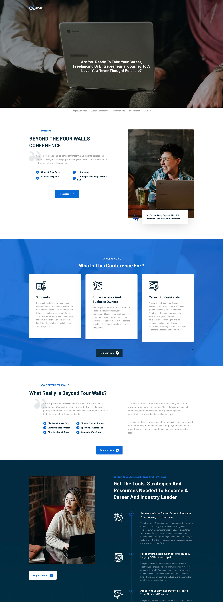
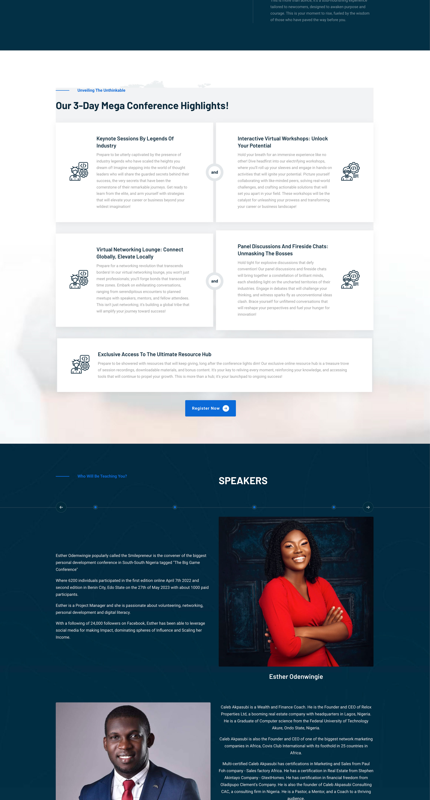
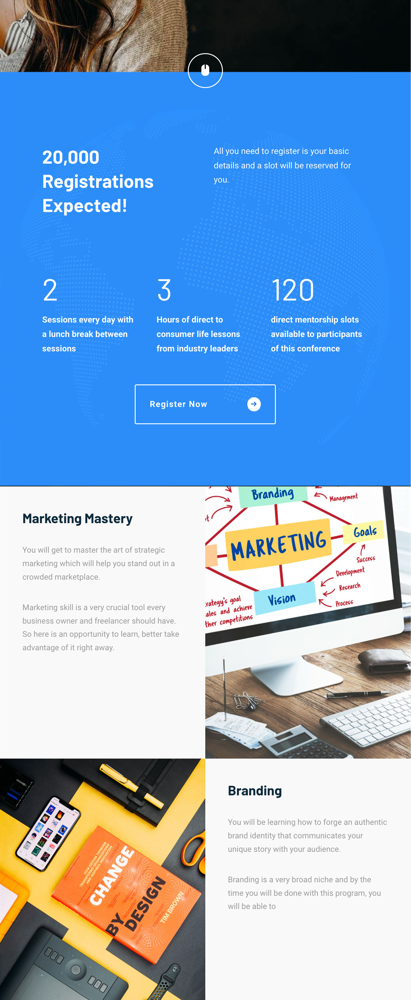

# Enski Integrated Limited - Beyond the Four Walls Conference

Welcome to the official repository for the "Beyond the Four Walls Conference" website template developed for Enski Integrated Limited's upcoming conference!

## About the Conference

The "Beyond the Four Walls Conference" is a highly anticipated conference organized by Enski Integrated Limited. This event brings together industry experts and professionals to share insights, tools, strategies and resources needed to become a career and industry leader

## Notable Facilitators

- **Esther Odemwingie**: Popularly called the Smilepreneur, she is the convener of the biggest personal development conference in South-South Nigeria tagged "The Big Game Conference"
- **Caleb Akpasubi**: A Wealth and Finance Coach, he is the Founder and CEO of Relox Properties Ltd, a booming real estate company with headquarters in Lagos, Nigeria
- **Habeebat Kamil**: Popularly known as Naijasalesqueen, she is a sales strategist and coach who has trained over 15,000 business owners and helped hundreds of business owners make 6-7 figures in their business.
- *(Amongst others)*

## Features of this template

- **Conference Registration**: A link to register for the conference and secure your spot.
- **Email Reminder Form**: Collects email addresses from individuals interested in receiving reminders before the conference date.
- **WhatsApp Community Link**: Provides a link to join the conference's WhatsApp community for networking and updates.

## Technologies Used

- HTML
- CSS
- JavaScript

## Screenshots

## Getting Started

To use this template for your own event or conference, simply clone this repository to your local machine and customize it according to your requirements.

## Contributing

Contributions to this project are welcome! If you have any suggestions for improvements or new features, please feel free to open an issue or submit a pull request.

## License

This project is licensed under the [MIT License](LICENSE).
